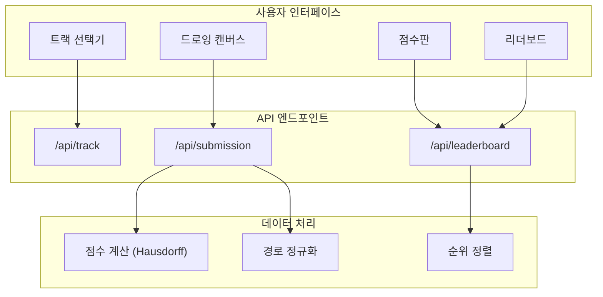
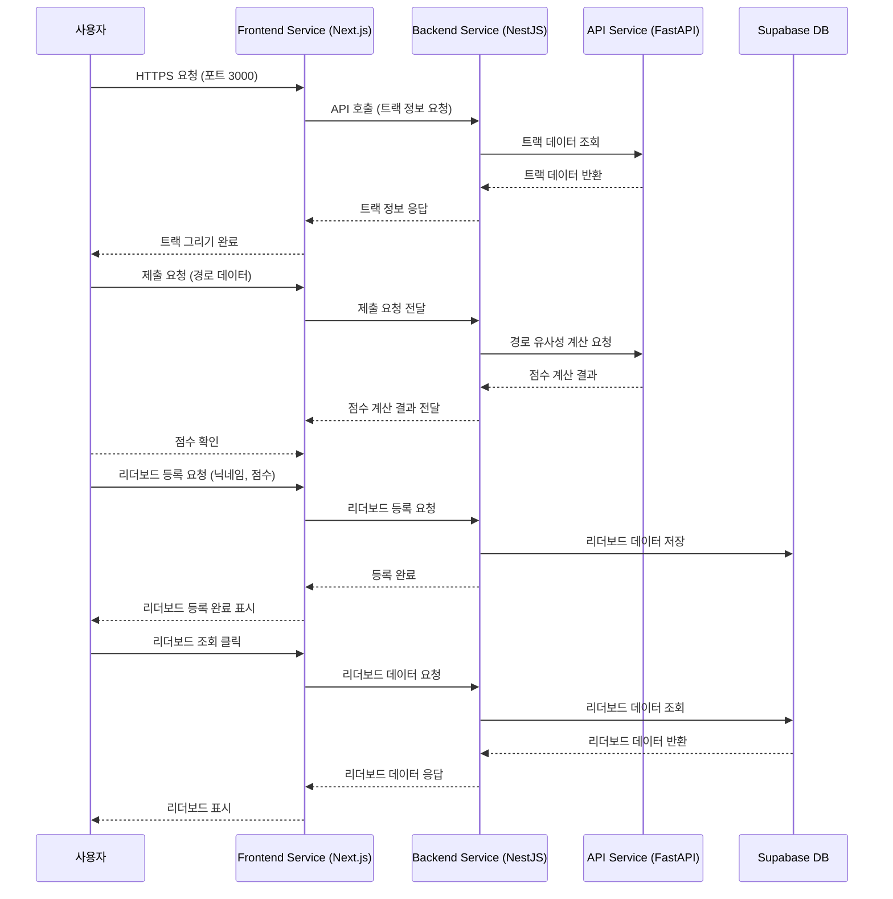

# F1 Sketch

## 🏎️ 프로젝트 개요

F1 Sketch는 사용자가 원하는 F1(포뮬러 원) 레이싱 서킷을 선택해 직접 트랙의 레이아웃을 그리고, 실제 트랙과의 유사도를 평가받아 리더보드에 공유하는 웹 서비스입니다.

### 핵심 기능

#### 🎯 트랙 선택 및 캔버스 드로잉

- 다양한 F1 서킷 중 원하는 트랙을 선택할 수 있습니다
- 선택한 트랙의 레이아웃을 5초간 보여준 뒤, 빈 캔버스 위에서 마우스와 터치 입력으로 트랙을 그릴 수 있습니다

#### 📊 경로 비교 및 점수 계산

- 0~100점 사이의 유사도 점수를 산출합니다
- 사용자가 그린 경로와 실제 트랙의 좌표를 정규화 과정을 거쳐 최적 매칭합니다
- 두 경로 간 오차를 기반으로 Hausdorff distance 알고리즘을 사용하여 점수를 계산합니다

#### 🏆 리더보드 시스템

- 게임의 최고 점수판처럼 이름과 점수를 제출해 다른 플레이어와 경쟁할 수 있습니다
- 각 트랙별 순위를 한눈에 확인할 수 있으며, 순위별 플레이어가 실제로 그린 경로를 시각화하여 비교할 수 있습니다

## 🛠️ 기술 스택

### Frontend

- **Framework**: Next.js 15 (App Router)
- **UI Library**: Chakra UI v3
- **Drawing**: HTML5 Canvas API
- **Language**: TypeScript
- **HTTP Client**: Axios
- **Internationalization**: react-i18next (한국어/영어 지원)

## 🏗️ 시스템 아키텍처





### 컴포넌트 구조

- **TrackSelector**: F1 트랙 선택 인터페이스
- **DrawingCanvas**: HTML5 Canvas 기반 드로잉 시스템
- **ScoreBoard**: 점수 표시 및 리더보드 제출
- **Leaderboard**: 순위표 및 경로 시각화

## 🌐 배포 및 접속

**웹사이트**: [f1sketch.com](https://f1sketch.com)

서비스는 현재 운영 중이며, 데스크톱과 모바일 환경 모두에서 접속 가능합니다.

## 🎨 주요 특징

### 다국어 지원

한국어와 영어를 지원하며, 사용자 인터페이스가 완전히 현지화되어 있습니다.

### 실시간 피드백

드로잉 완료 즉시 점수를 계산하고 결과를 표시합니다.

## 📋 개발 과정

### 기여도와 역할

프로젝트 기능 요구사항 정리 및 개발 타임라인은 다음 링크에서 확인할 수 있습니다:  
[프로젝트 관리 문서](https://guttural-stinger-5d4.notion.site/20caa997cf3680e18596f24354937e05?source=copy_link)

모든 기능 개발 및 배포는 개인 개발자로 진행하였습니다.

[백엔드 서비스](https://github.com/goosull/f1sketch_backend)
[API 서비스](https://github.com/goosull/f1sketch_api)

## 🚀 로컬 실행

```bash
npm run dev
# 또는
yarn dev
```

[http://localhost:3000](http://localhost:3000)에서 확인할 수 있습니다.
